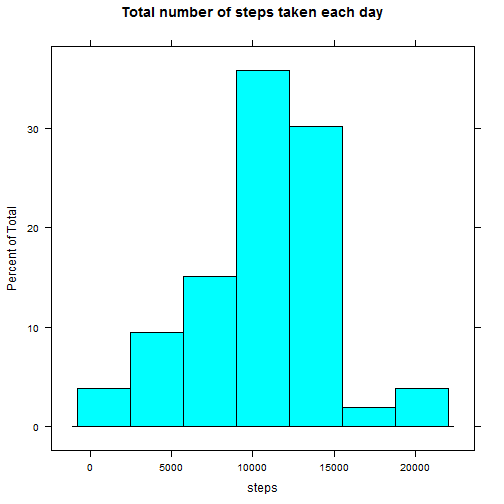
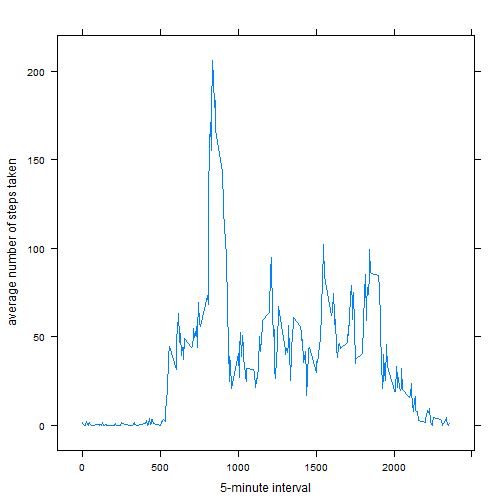
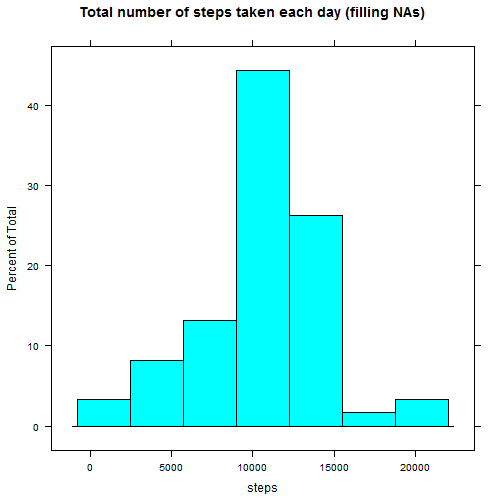

Peer Assigment number 1
==================================
## Loading and preprocessing the data

```r
# Load of Data
initialData<-read.csv("./activity.csv",sep=",",header=TRUE)
# Steps Column
initialData[,1]<-as.numeric(initialData[,1])
# Date Column
initialData[,2]<-as.Date(initialData[,2])
#Interval Column
initialData[,3]<-as.numeric(initialData[,3])
# Values that are not NA in the steps column
temp<-!is.na(initialData[,1])
# English Date System
Sys.setlocale("LC_TIME", "English")
```

```
## [1] "English_United States.1252"
```

```r
# Lattice library
library(lattice)
```

```
## Warning: package 'lattice' was built under R version 3.1.2
```

```r
# Processed Data
procesData<-initialData[temp,]
# Steps taken each day
dailySteps<-tapply(procesData$steps,procesData$date,sum)
dailySteps<-as.data.frame(dailySteps)
```
## What is mean total number of steps taken per day?

```r
# Histogram
histogram(dailySteps[,1],main="Total number of steps taken each day",xlab="steps")
```

 

```r
# Mean
mean(dailySteps[,1])
```

```
## [1] 10766.19
```

```r
# Median
median(dailySteps[,1])
```

```
## [1] 10765
```
## What is the average daily activity pattern?

```r
# Mean of each 5 min interval
meanInterval<-tapply(procesData$steps,procesData$interval,mean)
meanInterval<-unlist(meanInterval)
meanInterval<-as.data.frame(meanInterval)
tmp<-row.names(meanInterval)
tmp<-as.data.frame(tmp)
meanInterval<-cbind(meanInterval,tmp)
meanInterval<-as.data.frame(meanInterval)
names(meanInterval)<-c("steps","interval")
meanInterval$interval<-as.character(meanInterval$interval)
meanInterval$interval<-as.numeric(meanInterval$interval)
# Time series
xyplot(steps ~ interval,data=meanInterval,type="l",xlab="5-minute interval",ylab="average number of steps taken")
```

 

```r
# Step which the maximum value
tmp<-sort(meanInterval$steps,decreasing=TRUE)
tmp<-as.data.frame(tmp)
lista<-row.names(tmp)
lista[1]
```

```
## [1] "835"
```
## Imputing missing values

```r
# Missing Values
a<-dim(initialData)
b<-dim(procesData)
diff<-a-b
numberNA<-diff[1]
numberNA
```

```
## [1] 2304
```

```r
# Filling missing values
zeroData<-initialData[!temp,]
zeroData$interval<-as.numeric(zeroData$interval)
# Writting over zeros with the mean of the interval
for (i in 1:numberNA){
        timeInt<-zeroData$interval[i]
        index<-(row.names(meanInterval)==timeInt)
        valor<-meanInterval[,1][index]
        zeroData$steps[i]=valor[[1]]
}
# Merging of the Processing Data
finalData<-rbind(procesData,zeroData)
# Ordering the final Data
lista<-order(finalData$date)
finalData<-finalData[lista,]
# Steps taken each day
dailySteps2<-tapply(finalData$steps,finalData$date,sum)
dailySteps2<-as.data.frame(dailySteps2)
# Histogram
histogram(dailySteps2[,1],main="Total number of steps taken each day (filling NAs)",xlab="steps")
```

 

```r
# Mean
mean(dailySteps2[,1])
```

```
## [1] 10766.19
```

```r
# Median
median(dailySteps2[,1])
```

```
## [1] 10766.19
```
## Are there differences in activity patterns between weekdays and weekends?

```r
# Weekdays and Weekend
days<-weekdays(finalData$date)
days<-as.factor(days)
levels(days)<-c("Weekday","Weekday","Weekend","Weekend","Weekday","Weekday","Weekday")
finalData<-cbind(finalData,days)
# Average step each interval weekday/weekend
library(plyr)
```

```
## Warning: package 'plyr' was built under R version 3.1.2
```

```
## 
## Attaching package: 'plyr'
## 
## The following object is masked from 'package:lubridate':
## 
##     here
```

```r
averagSteps<-ddply(finalData,c("interval","days"),function(df)mean(df$steps))
# Plotting
xyplot(V1 ~ interval|days,data=averagSteps,type="l",xlab="Interval",
       ylab="Number of steps",layout=c(1,2))
```

 
